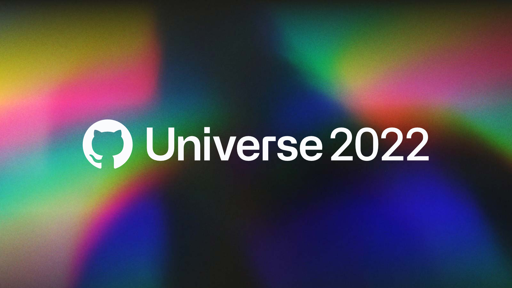

# Building CI/CD Developers Experience with GitHub

  

## About this article 

GitHub with GitHubActions and GHAS offer an incredible experience for developers around the planet. Just with a few considerations and a good ideas we can build a wonderful experience for our development teams, and they just literally “work only on their code”

## Code as a company asset

https://dzone.com/articles/source-code-asset-not

## Coexistence Agreements

**Owner Accountability**
+ Teams: Teams + Member Roles, Custome Roles
+ Teams Discussion
+ Repository: Labels, Roles, Topics, Member Privileges
+ Github Actions Workflows - General Topics
+ Organization Secrets

**Development Teams Accountability**

+ Templates
+ Branches + Protection Rules
+ Github Actions - Particular Topics

## Developers diversity with an unique experience

+ Data
+ Infrastructure
+ Front-end
+ Back-End
+ Native Apps

## Complement your experience with your own products

+ Actions Marketplace
+ NPM
+ Container Base Line
+ Infrastructure Modules
+ Ansible Roles
+ Re-usable workflows

## Creating secure code at the beginning

OSS + GHAS (Enterprise)

https://docs.github.com/es/enterprise-cloud@latest/get-started/learning-about-github/about-github-advanced-security

## Metrics as continuos improvement enabler