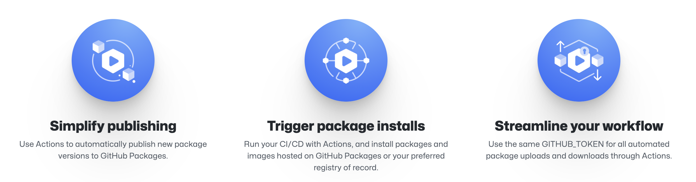

# Building CI/CD Developers Experience with GitHub

<p align="left" style="text-align:left;">
  <a href="https://www.githubuniverse.com/">
    
  </a>
</p>

## About this article 

GitHub with GitHubActions and GHAS offer an incredible experience for developers around the planet. Just with a few considerations and good ideas we can build a wonderful experience for our development teams, and they just literally “work only on their code”

## Code as a company asset

If you build and operate a power plant or a bridge, you have to maintain it – just like software. And like a bridge or a power plant, a newer, more modern, better-designed, more efficient and simpler asset is better than a big, old, complicated, expensive-to-maintain one.

The ***software is a liability*** argument seems to be that it’s not the software that’s the asset, it’s the “features and options” – the capabilities that the software provides. This is like saying that it’s not the power plant (which a company spent millions of dollars to design and engineer) that’s a valuable asset to a company, it’s the energy that it generates. It’s not the bridge – it’s the ability to drive over water. It’s not the airplane, it’s the ability to fly.

Pretending that software has no value in itself is silly. Try explaining this to accountants (don’t depreciate the airplane, depreciate the ability to fly!) and IP lawyers and to investors who buy software companies for their IP. They all understand that software and the ideas embodied in it are valuable and need to be treated as assets. The ideas themselves are only worth so much, even if they’re patented. But the ideas realized in software, actualized and proven and ready to be used or (better) already being used – that’s where the real value is. And this is the value that needs to be maintained and preserved.

[**Github**](https://github.com/features) enable the tools that you need to build that you want, enabling to you and your organizations the capabilities to ***Contribute to projects quiclky with automatic environment setup***, making visibility about ***the changes you care about***, and finally, but not less important, ***building community aroun your code***

In the next chapters, we'll share a way to work with a big part of [**Github**](https://github.com/features) features, and how you can bring to your developers teams, and excellent and reliability experience, guaranting keep your asset **secure** and **updated**.

<br>

## Coexistence Agreements

### Owner Accountability
#### Organization Teams

[Teams](https://docs.github.com/en/organizations/organizing-members-into-teams/about-teams) are groups of organization members that reflect your company or group's structure with cascading access permissions and mentions.

If you have the role of Organization Owners or Team Maintainers can give teams admin, read, or write access to organization repositories.

You can define a lot ot diferents permisions (Defining [Team Mantainers](https://docs.github.com/en/organizations/organizing-members-into-teams/assigning-the-team-maintainer-role-to-a-team-member),[Defining Other Roles](https://docs.github.com/en/organizations/managing-peoples-access-to-your-organization-with-roles/roles-in-an-organization)), Including [Child Teams](https://docs.github.com/en/organizations/organizing-members-into-teams/requesting-to-add-a-child-team), or enable communications cross channels([Enable Code Review Settings](https://docs.github.com/en/organizations/organizing-members-into-teams/managing-code-review-settings-for-your-team), [Enable Team Discussions](https://docs.github.com/en/organizations/collaborating-with-your-team/about-team-discussions)), but the most important, **you must define this of the begining**, to simplify the way that developers do his job, to promote that your teams "**stay focus on development**".

#### Organization Repositories

A [repository](https://docs.github.com/en/enterprise-cloud@latest/repositories) contains all of your project's files and each file's revision history. You can discuss and manage your project's work within the repository.
[repository visibility](https://docs.github.com/en/enterprise-cloud@latest/repositories/creating-and-managing-repositories/about-repositories#about-repository-visibility)
[create a new repository](https://docs.github.com/en/enterprise-cloud@latest/repositories/creating-and-managing-repositories/creating-a-new-repository)
[create a new repository from template](https://docs.github.com/en/enterprise-cloud@latest/repositories/creating-and-managing-repositories/creating-a-repository-from-a-template)
[manage repository with topics](https://docs.github.com/en/repositories/managing-your-repositorys-settings-and-features/customizing-your-repository/classifying-your-repository-with-topics)
[including readme](https://docs.github.com/en/repositories/managing-your-repositorys-settings-and-features/customizing-your-repository/about-readmes)
[including licence](https://docs.github.com/en/repositories/managing-your-repositorys-settings-and-features/customizing-your-repository/licensing-a-repository)
[repository roles](https://docs.github.com/en/organizations/managing-access-to-your-organizations-repositories/repository-roles-for-an-organization)
[manage team access](https://docs.github.com/en/organizations/managing-access-to-your-organizations-repositories/managing-team-access-to-an-organization-repository)
[manage individual access](https://docs.github.com/en/organizations/managing-access-to-your-organizations-repositories/managing-an-individuals-access-to-an-organization-repository)
[setting base permissions](https://docs.github.com/en/organizations/managing-access-to-your-organizations-repositories/setting-base-permissions-for-an-organization)
[repository labels](https://docs.github.com/en/issues/using-labels-and-milestones-to-track-work/managing-labels)

#### Deliver Github Actions as a Service

#### Organization Encrypted Secrets

### Development Teams Accountability

[create a new repository](https://docs.github.com/en/enterprise-cloud@latest/repositories/creating-and-managing-repositories/creating-a-new-repository)
[create a new repository from template](https://docs.github.com/en/enterprise-cloud@latest/repositories/creating-and-managing-repositories/creating-a-repository-from-a-template)
[manage branches](https://docs.github.com/en/repositories/configuring-branches-and-merges-in-your-repository/managing-branches-in-your-repository/viewing-branches-in-your-repository)
[branch protection rules](https://docs.github.com/en/repositories/configuring-branches-and-merges-in-your-repository/defining-the-mergeability-of-pull-requests/managing-a-branch-protection-rule)

#### Consuming Github Actions Service

## Developers diversity with an unique experience

+ Data
+ Infrastructure
+ Front-end
+ Back-End
+ Native Apps

## Complement your experience with your own products

### Github Actions

[GitHub Actions](https://docs.github.com/en/actions/learn-github-actions/understanding-github-actions) is a continuous integration and continuous delivery (CI/CD) platform that allows you to automate your build, test, and deployment pipeline. You can create workflows that build and test every pull request to your repository, or deploy merged pull requests to production.

[GitHub Actions](https://docs.github.com/en/actions/learn-github-actions/understanding-github-actions) goes beyond just DevOps and lets you run workflows when other events happen in your repository. For example, you can run a workflow to automatically add the appropriate labels whenever someone creates a new issue in your repository.

GitHub provides Linux, Windows, and macOS virtual machines to run your workflows, or you can host your own self-hosted runners in your own data center or cloud infrastructure.

<p align="left" style="text-align:left;">
  <a href="https://github.com/features/actions">
    
  </a>
</p>

You can find a lot of actions examples in community resources like [awesome actions](https://github.com/sdras/awesome-actions) with Multi-Platform and Multi-Proposit examples.

<br>

### Github MarketPlace

[GitHub Marketplace](https://github.com/marketplace) connects you to developers who want to extend and improve their GitHub workflows. You can list free and paid tools for developers to use in GitHub Marketplace. GitHub Marketplace offers developers two types of tools: GitHub Actions and Apps, and each tool requires different steps for adding it to [GitHub Marketplace](https://github.com/marketplace).

This is an [example of contribution](https://github.com/marketplace/actions/packer-github-actions-with-ansible-provisioner) on 
[GitHub Marketplace](https://github.com/marketplace) with an Action that runs [Hashicorp Packer](https://www.packer.io) ```commands```, you can use it on your workflows

```
name: Packer

on:
  push:

jobs:
  packer:
    runs-on: ubuntu-latest
    name: packer

    steps:
      - name: Checkout Repository
        uses: actions/checkout@v2

      - name: Fix Template
        uses: jveraduran/packer-github-actions@master
        with:
          command: fix

      - name: Validate Template
        uses: jveraduran/packer-github-actions@master
        with:
          command: validate
          arguments: -syntax-only
          target: packer.pkr.hcl

      - name: Build Artifact
        uses: jveraduran/packer-github-actions@master
        with:
          command: build
          arguments: "-color=false -on-error=abort"
          target: packer.pkr.hcl
          working_directory: infrastructure/packer
        env:
          PACKER_LOG: 1
          HCP_CLIENT_ID: ${{ secrets.HCP_CLIENT_ID }}
          HCP_CLIENT_SECRET: ${{ secrets.HCP_CLIENT_SECRET }}
```
<br>

If you want to [create and publish your own Action](https://docs.github.com/en/actions/creating-actions/publishing-actions-in-github-marketplace), please consider this [security tips](https://docs.github.com/en/actions/security-guides/security-hardening-for-github-actions?learn=getting_started&learnProduct=actions) from Github.

### Github Reusable Workflows

Rather than copying and pasting from one workflow to another, you can make workflows reusable. You and anyone with access to the reusable workflow can then call the reusable workflow from another workflow.

Reusing workflows avoids duplication. This makes workflows easier to maintain and allows you to create new workflows more quickly by building on the work of others, just as you do with actions. Workflow reuse also promotes best practice by helping you to use workflows that are well designed, have already been tested, and have been proved to be effective. Your organization can build up a library of reusable workflows that can be centrally maintained.

The diagram below shows three build jobs on the left of the diagram. After each of these jobs completes successfully a dependent job called "Deploy" runs. This job calls a reusable workflow that contains three jobs: "Staging", "Review", and "Production." The "Production" deployment job only runs after the "Staging" job has completed successfully. Using a reusable workflow to run deployment jobs allows you to run those jobs for each build without duplicating code in workflows.

<p align="left" style="text-align:left;">
  <a href="https://docs.github.com/en/actions/using-workflows/reusing-workflows">
    
  </a>
</p>

A workflow that uses another workflow is referred to as a "caller" workflow. The reusable workflow is a "called" workflow. One caller workflow can use multiple called workflows. Each called workflow is referenced in a single line. The result is that the caller workflow file may contain just a few lines of YAML, but may perform a large number of tasks when it's run. When you reuse a workflow, the entire called workflow is used, just as if it was part of the caller workflow.

If you reuse a workflow from a different repository, any actions in the called workflow run as if they were part of the caller workflow. For example, if the called workflow uses ```actions/checkout```, the action checks out the contents of the repository that hosts the caller workflow, not the called workflow.

When a reusable workflow is triggered by a caller workflow, the ```github``` context is always associated with the caller workflow. The called workflow is automatically granted access to ```github.token``` and ```secrets.GITHUB_TOKEN```. For more information about the ```github context```, see ["Context and expression syntax for GitHub Actions](https://docs.github.com/en/actions/reference/context-and-expression-syntax-for-github-actions#github-context)."

You can view the reused workflows referenced in your GitHub Actions workflows as dependencies in the dependency graph of the repository containing your workflows. For more information, see “[About the dependency graph](https://docs.github.com/en/code-security/supply-chain-security/understanding-your-software-supply-chain/about-the-dependency-graph).”

<br>

### Github NPM Registry
GitHub Packages is a software package hosting service provided by GitHub that allows you to host your software packages such as npm, docker, gem, dotnet, mvn, gradle in privately or publicly and use packages as dependencies in your projects.

You can integrate GitHub Packages with GitHub APIs, GitHub Actions, and webhooks to create an end-to-end DevOps workflow that includes your code, CI, and deployment solutions.

A package is a file or directory that is described by a package.json file. A package must contain a package.json file in order to be published to the npm registry. For more information on creating a package.json file, see "Creating a package.json file".

Packages can be unscoped or scoped to a user or organization, and scoped packages can be private or public

**¿Why use a Private Registry?**

+ **Central hub for all your required package versions:** Private and public together, possibly from multiple upstream sources.
  
+ **Identification and visualization of dependencies:** With all required packages in one place it enables identification of potential issues. Additionally the proxy caches your packages, removing the worry that an essential package version will be unpublished in the future.
  
+ **Single package source:** With all developers using the same registry that contains the same versions, you can ensure all users build and test consistently. Removing the potential issue of unknowingly using different versions of a dependency.

This is a [Github Repository](https://github.com/jveraduran/github-npm-registry-be) with a Back-End Example about using [Github NPM Registry](https://docs.github.com/es/packages/working-with-a-github-packages-registry/working-with-the-npm-registry). ¿Do you have any doubt?, please feel you free to open and issue.

<br>

<p align="left" style="text-align:left;">
  <a href="https://github.com/features/packages">
    
  </a>
</p>

<br>

### Github Container Registry

GitHub Packages is a software package hosting service provided by GitHub that allows you to host your software packages such as npm, docker, gem, dotnet, mvn, gradle in privately or publicly and use packages as dependencies in your projects.

You can integrate GitHub Packages with GitHub APIs, GitHub Actions, and webhooks to create an end-to-end DevOps workflow that includes your code, CI, and deployment solutions.

Container image registries can offer significant advantages for developers but with one caveat attached: not all registries are created equally.

Public registry services are basic, simple to use and can work well for individuals and smaller teams. But once teams begin to scale up, they run into numerous issues with public registries. A private container registry with scanning capabilities and role-based access control offers more security, governance and efficient management

**¿Why Use a Container Image Registry?**

The registry remains a source of truth for the images you want to run. The first advantage is you have the same piece of code running everywhere. The second advantage is that piece of code is guarded in a repository controlled by IT so you can easily revert to a clean environment. The result is the end of “config drift” in production

**¿What is Github Container Registry?**

The [Container registry](https://docs.github.com/en/packages/working-with-a-github-packages-registry/working-with-the-container-registry) stores container images within your organization or personal account, and allows you to associate an image with a repository. You can choose whether to inherit permissions from a repository, or set granular permissions independently of a repository. You can also access public container images anonymously.

<br>

<p align="left" style="text-align:left;">
  <a href="https://github.com/features/packages">
    
  </a>
</p>

<br>

This is a [Github Repository](https://github.com/jveraduran/container-registry) example about using [Github Container Registry](https://docs.github.com/en/packages/working-with-a-github-packages-registry/working-with-the-container-registry). ¿Do you have any doubt?, please feel you free to open and issue.

+ Infrastructure Modules
+ Ansible Roles

## Creating secure code at the beginning

OSS + GHAS (Enterprise)

https://docs.github.com/es/enterprise-cloud@latest/get-started/learning-about-github/about-github-advanced-security

## Metrics as continuos improvement enabler
